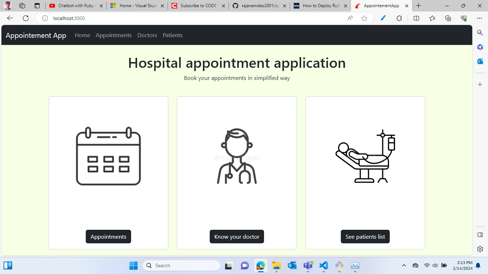
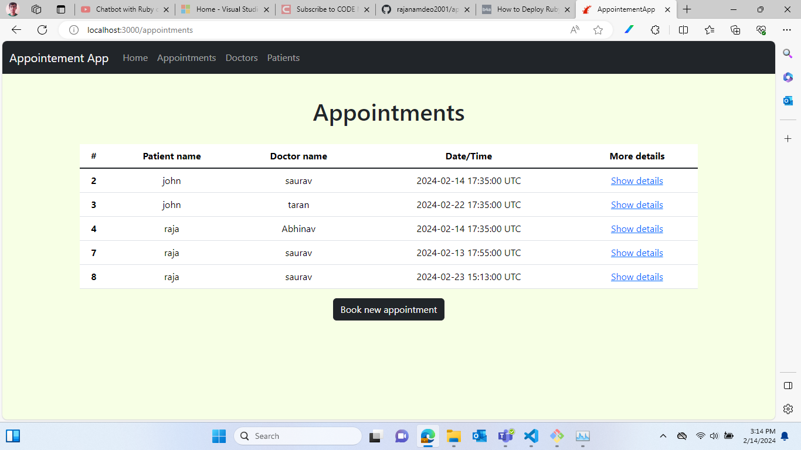
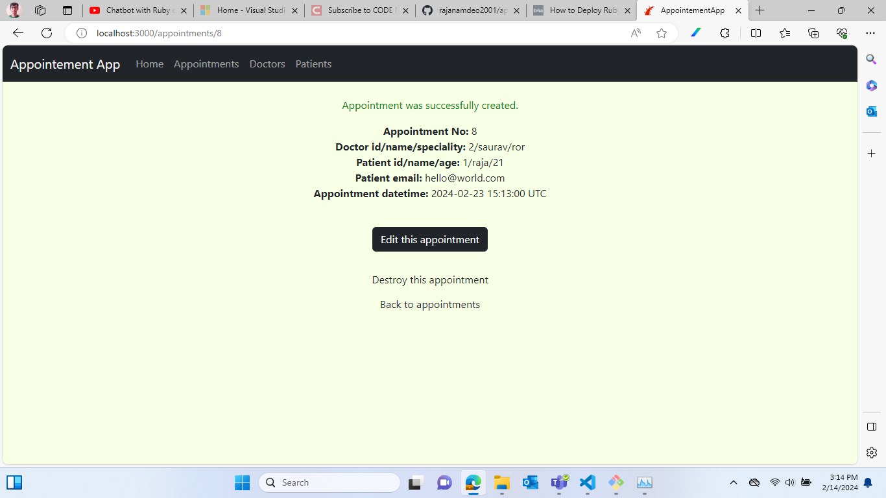
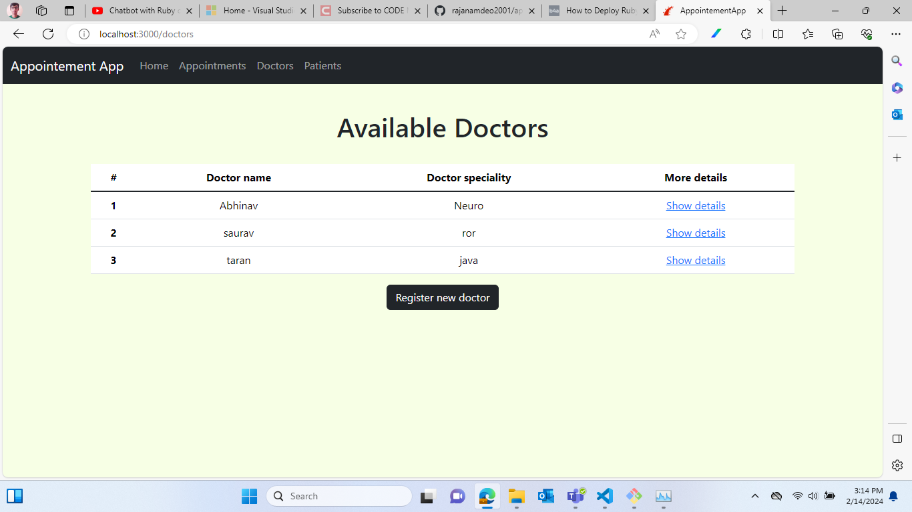
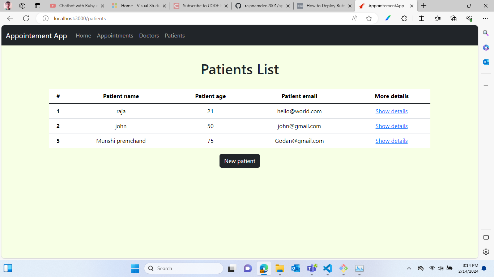

# README

## About Application
Hospital apppoitment application made with Ruby and bootstrap on rails, have functionality to register new doctors (based on their speciality), patient (with contact & age) and Book appointments.

## Application snaps

### 1.

### 2.

### 3.

### 4.

### 5.
 